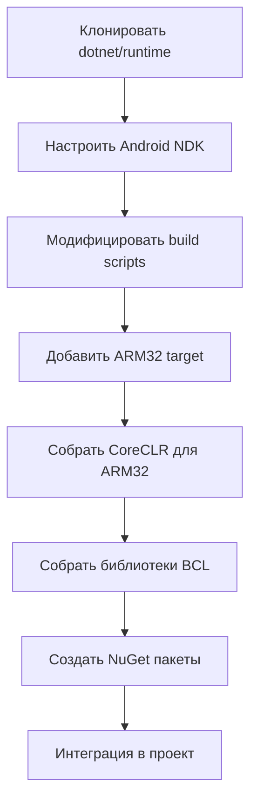

# Custom .NET Runtime Build for ARM32 - Technical Plan

## Вопрос
Можно ли сделать специальную сборку .NET runtime под ARM32?

## Краткий ответ
**Да, технически возможно**, но это сложный процесс с несколькими подходами. Рекомендуемое решение - использовать .NET 8.0 LTS с официальной поддержкой ARM32 вместо создания кастомной сборки .NET 10.0.

---

## Анализ текущей ситуации

### Текущая архитектура проекта
- **Основной фреймворк**: .NET 10.0 (net10.0)
- **MAUI проекты**: net10.0-windows, net10.0-android
- **Целевые платформы**: 
  - Windows: x64, ARM64
  - Android: ARM64 (arm64-v8a)
- **Отсутствует**: Android ARM32 (armeabi-v7a)

### Проблема
.NET 10.0 **не поддерживает ARM32** официально:
- Microsoft прекратила поддержку ARM32 начиная с .NET 6.0
- Нет официальных runtime пакетов для linux-arm или android-arm
- Современные устройства используют ARM64, но многие старые Android устройства (до 2014-2016 года) используют ARM32

---

## Варианты решения

### Вариант 1: Использование .NET 8.0 LTS (РЕКОМЕНДУЕТСЯ) ⭐

#### Преимущества
- ✅ **Официальная поддержка ARM32** через `android-arm` RID
- ✅ **LTS поддержка** до ноября 2026 года
- ✅ **Стабильность** - проверенная версия
- ✅ **Совместимость** с существующим кодом
- ✅ **Простота внедрения** - не требует кастомной сборки runtime

#### Реализация
Уже есть готовый план в [`plans/legacy-support-branch-plan.md`](plans/legacy-support-branch-plan.md:1):

```xml
<!-- Directory.Build.props -->
<NetCoreTargetFramework>net8.0</NetCoreTargetFramework>

<!-- Iskra.Maui.csproj -->
<TargetFrameworks>net8.0-android</TargetFrameworks>
<RuntimeIdentifiers>android-arm;android-arm64</RuntimeIdentifiers>
<AndroidSupportedAbis>armeabi-v7a;arm64-v8a</AndroidSupportedAbis>
```

#### Пакеты для ARM32
```xml
<PackageReference Include="Microsoft.NETCore.App.Runtime.android-arm" Version="8.0.11" />
```

---

### Вариант 2: Кастомная сборка .NET Runtime из исходников

#### Описание
Собрать .NET 10.0 runtime с поддержкой ARM32 из исходного кода dotnet/runtime.

#### Сложность: 🔴 ОЧЕНЬ ВЫСОКАЯ

#### Требования

**Аппаратные:**
- Мощный сервер сборки (16+ GB RAM, 8+ CPU cores)
- 50+ GB свободного места на диске
- Linux build environment (Ubuntu 22.04 рекомендуется)

**Программные:**
- CMake 3.20+
- Clang 16+ или GCC 11+
- Python 3.8+
- Android NDK r25c или новее
- Git

#### Процесс сборки



#### Шаги реализации

##### 1. Подготовка окружения

```bash
# Клонировать репозиторий
git clone https://github.com/dotnet/runtime.git
cd runtime
git checkout release/10.0

# Установить зависимости (Ubuntu)
sudo apt-get update
sudo apt-get install -y \
    cmake \
    llvm \
    clang \
    build-essential \
    python3 \
    git \
    curl
```

##### 2. Настройка Android NDK

```bash
# Скачать Android NDK
wget https://dl.google.com/android/repository/android-ndk-r25c-linux.zip
unzip android-ndk-r25c-linux.zip
export ANDROID_NDK_ROOT=$PWD/android-ndk-r25c

# Создать standalone toolchain для ARM32
$ANDROID_NDK_ROOT/build/tools/make_standalone_toolchain.py \
    --arch arm \
    --api 21 \
    --install-dir $PWD/arm-toolchain
```

##### 3. Модификация build конфигурации

Создать файл `eng/native/build-android-arm.sh`:

```bash
#!/bin/bash

# Конфигурация для Android ARM32
export ROOTFS_DIR=$PWD/arm-toolchain/sysroot
export ANDROID_NDK_ROOT=$PWD/android-ndk-r25c
export ANDROID_API_LEVEL=21

# Сборка CoreCLR
./build.sh \
    --subset clr \
    --arch arm \
    --os android \
    --cross \
    --configuration Release

# Сборка библиотек
./build.sh \
    --subset libs \
    --arch arm \
    --os android \
    --cross \
    --configuration Release
```

##### 4. Сборка runtime

```bash
chmod +x eng/native/build-android-arm.sh
./eng/native/build-android-arm.sh
```

##### 5. Создание NuGet пакетов

```bash
# Упаковать runtime
./build.sh \
    --subset packs \
    --arch arm \
    --os android \
    --configuration Release

# Пакеты будут в artifacts/packages/Release/Shipping/
```

##### 6. Интеграция в проект

```xml
<!-- NuGet.config -->
<configuration>
  <packageSources>
    <add key="CustomRuntime" value="./custom-runtime-packages" />
  </packageSources>
</configuration>

<!-- Iskra.Maui.csproj -->
<ItemGroup>
  <PackageReference Include="Microsoft.NETCore.App.Runtime.android-arm" 
                    Version="10.0.0-custom" />
</ItemGroup>
```

#### Проблемы и риски

❌ **Критические проблемы:**
1. **Отсутствие официальной поддержки** - Microsoft удалила ARM32 код из .NET 6+
2. **Несовместимость зависимостей** - многие библиотеки не поддерживают ARM32
3. **Сложность поддержки** - нужно пересобирать при каждом обновлении
4. **Тестирование** - требуется обширное тестирование на реальных устройствах
5. **Производительность** - возможны проблемы с JIT компилятором
6. **Размер** - увеличение размера APK на 20-30 MB

⚠️ **Дополнительные риски:**
- Проблемы с AOT компиляцией
- Несовместимость с MAUI компонентами
- Отсутствие поддержки от Microsoft
- Сложности с отладкой

---

### Вариант 3: Использование Mono Runtime

#### Описание
Использовать Mono runtime вместо CoreCLR для ARM32 устройств.

#### Преимущества
- ✅ Mono поддерживает ARM32
- ✅ Используется в Xamarin.Android
- ✅ Меньше модификаций требуется

#### Недостатки
- ❌ Mono устарел для новых проектов
- ❌ Хуже производительность чем CoreCLR
- ❌ Ограниченная совместимость с .NET 10.0 API

#### Реализация

```xml
<PropertyGroup Condition="'$(TargetFramework)' == 'net10.0-android' AND '$(RuntimeIdentifier)' == 'android-arm'">
  <UseMonoRuntime>true</UseMonoRuntime>
  <MonoEnableLLVM>false</MonoEnableLLVM>
</PropertyGroup>
```

---

### Вариант 4: Гибридный подход

#### Описание
Использовать разные версии .NET для разных архитектур:
- **ARM64**: .NET 10.0 (современные устройства)
- **ARM32**: .NET 8.0 (legacy устройства)

#### Реализация

```xml
<!-- Multi-targeting -->
<TargetFrameworks>net10.0-android;net8.0-android</TargetFrameworks>

<PropertyGroup Condition="'$(TargetFramework)' == 'net8.0-android'">
  <RuntimeIdentifiers>android-arm</RuntimeIdentifiers>
  <DefineConstants>$(DefineConstants);LEGACY_ARM32</DefineConstants>
</PropertyGroup>

<PropertyGroup Condition="'$(TargetFramework)' == 'net10.0-android'">
  <RuntimeIdentifiers>android-arm64</RuntimeIdentifiers>
</PropertyGroup>
```

#### Преимущества
- ✅ Официальная поддержка обеих версий
- ✅ Оптимальная производительность для каждой платформы
- ✅ Проще поддерживать

#### Недостатки
- ❌ Два APK файла
- ❌ Дублирование кода
- ❌ Сложнее CI/CD

---

## Сравнительная таблица

| Критерий | .NET 8.0 LTS | Кастомная сборка | Mono | Гибридный |
|----------|--------------|------------------|------|-----------|
| Сложность | 🟢 Низкая | 🔴 Очень высокая | 🟡 Средняя | 🟡 Средняя |
| Поддержка | 🟢 Официальная | 🔴 Нет | 🟡 Ограниченная | 🟢 Официальная |
| Производительность | 🟢 Отличная | 🟡 Неизвестно | 🟡 Средняя | 🟢 Отличная |
| Стабильность | 🟢 Высокая | 🔴 Низкая | 🟡 Средняя | 🟢 Высокая |
| Время внедрения | 1-2 дня | 2-4 недели | 1 неделя | 3-5 дней |
| Риски | 🟢 Минимальные | 🔴 Критические | 🟡 Средние | 🟢 Низкие |

---

## Рекомендации

### Для вашего проекта Iskra Messenger

**Рекомендуемое решение: Вариант 1 (.NET 8.0 LTS)** ⭐

#### Обоснование:
1. **У вас уже есть план** - [`legacy-support-branch-plan.md`](plans/legacy-support-branch-plan.md:1)
2. **Минимальные риски** - официальная поддержка
3. **Быстрое внедрение** - 1-2 дня работы
4. **LTS поддержка** до ноября 2026
5. **Совместимость** - весь ваш код будет работать

#### Целевые устройства ARM32:
- Android 5.0+ (API 21+) на ARM32
- Старые смартфоны 2012-2016 годов
- Бюджетные устройства развивающихся рынков

### Если нужен именно .NET 10.0

**Альтернатива: Вариант 4 (Гибридный подход)**

Создать два варианта приложения:
- **Iskra Modern** - .NET 10.0 для ARM64 (основная версия)
- **Iskra Legacy** - .NET 8.0 для ARM32 (legacy версия)

---

## План внедрения (Рекомендуемый вариант)

### Этап 1: Создание legacy-support ветки
```bash
git checkout -b legacy-support
```

### Этап 2: Обновление конфигурации

#### 2.1 Обновить Directory.Build.props
```xml
<NetCoreTargetFramework>net8.0</NetCoreTargetFramework>
<MicrosoftExtensionsVersion>8.0.2</MicrosoftExtensionsVersion>
```

#### 2.2 Обновить Iskra.Maui.csproj
```xml
<TargetFrameworks>net8.0-windows10.0.19041.0</TargetFrameworks>
<TargetFrameworks Condition="'$(ShortP2PBuildAndroid)' == 'true'">
  $(TargetFrameworks);net8.0-android
</TargetFrameworks>

<PropertyGroup Condition="$(TargetFramework.Contains('-android'))">
  <RuntimeIdentifiers>android-arm;android-arm64</RuntimeIdentifiers>
  <AndroidSupportedAbis>armeabi-v7a;arm64-v8a</AndroidSupportedAbis>
  <TargetPlatformVersion>34.0</TargetPlatformVersion>
  <SupportedOSPlatformVersion>21.0</SupportedOSPlatformVersion>
</PropertyGroup>
```

### Этап 3: Обновление пакетов

```bash
# Обновить все пакеты до версий 8.x
dotnet add package Microsoft.Maui.Controls --version 8.0.90
dotnet add package Microsoft.Extensions.Logging --version 8.0.2
```

### Этап 4: Сборка для ARM32

```bash
# Сборка APK для ARM32
dotnet publish src/Iskra.Maui/Iskra.Maui.csproj \
  -f net8.0-android \
  -c Release \
  -r android-arm \
  -p:AndroidSupportedAbis=armeabi-v7a

# Сборка APK для ARM64
dotnet publish src/Iskra.Maui/Iskra.Maui.csproj \
  -f net8.0-android \
  -c Release \
  -r android-arm64 \
  -p:AndroidSupportedAbis=arm64-v8a
```

### Этап 5: Создание build скриптов

Создать `scripts/build_android_arm32.ps1`:

```powershell
# Build script for Android ARM32
param(
    [string]$Configuration = "Release"
)

$ErrorActionPreference = "Stop"

Write-Host "Building Iskra Messenger for Android ARM32..." -ForegroundColor Green

# Restore dependencies
dotnet restore src/Iskra.Maui/Iskra.Maui.csproj

# Build and publish
dotnet publish src/Iskra.Maui/Iskra.Maui.csproj `
    -f net8.0-android `
    -c $Configuration `
    -r android-arm `
    -p:AndroidSupportedAbis=armeabi-v7a `
    -p:ShortP2PBuildAndroid=true `
    -o artifacts/android-arm32

Write-Host "Build completed! APK location: artifacts/android-arm32" -ForegroundColor Green
```

### Этап 6: Тестирование

1. **Эмулятор**: Создать ARM32 эмулятор в Android Studio
2. **Реальные устройства**: Тестировать на старых Android устройствах
3. **Функциональность**: Проверить все функции приложения

---

## Технические детали ARM32

### Архитектура ARM32 (ARMv7)
- **Instruction Set**: ARMv7-A
- **ABI**: armeabi-v7a (с поддержкой NEON)
- **Минимальный Android**: API 21 (Android 5.0)
- **Регистры**: 32-bit
- **SIMD**: NEON (опционально)

### Ограничения ARM32
- Максимум 4 GB RAM (обычно 1-2 GB на практике)
- Медленнее чем ARM64 на 20-40%
- Нет поддержки некоторых современных инструкций
- Ограниченная поддержка криптографии

### Оптимизации для ARM32

```xml
<PropertyGroup Condition="'$(RuntimeIdentifier)' == 'android-arm'">
  <!-- Отключить AOT для стабильности -->
  <RunAOTCompilation>false</RunAOTCompilation>
  <AndroidEnableProfiledAot>false</AndroidEnableProfiledAot>
  
  <!-- Отключить LLVM -->
  <EnableLLVM>false</EnableLLVM>
  
  <!-- Минимальная обрезка -->
  <PublishTrimmed>false</PublishTrimmed>
  
  <!-- Использовать интерпретатор -->
  <UseInterpreter>false</UseInterpreter>
</PropertyGroup>
```

---

## Зависимости и совместимость

### Проверенные пакеты (ARM32 совместимые)

✅ **Работают на ARM32:**
- Microsoft.Maui.Controls 8.x
- SQLitePCLRaw.lib.e_sqlite3.android
- LiteDB 5.x
- NLog 5.x
- Concentus (Opus codec)

⚠️ **Требуют проверки:**
- Некоторые native библиотеки
- Специфичные Android bindings

❌ **Не работают:**
- Пакеты только для ARM64
- Некоторые ML.NET компоненты

### Проверка совместимости пакета

```bash
# Скачать и проверить содержимое NuGet пакета
nuget install PackageName -Version X.Y.Z
unzip PackageName.X.Y.Z.nupkg -d temp
ls temp/runtimes/
# Ищем: android-arm или monoandroid
```

---

## Размер приложения

### Сравнение размеров APK

| Конфигурация | Размер APK | Примечание |
|--------------|------------|------------|
| ARM64 only (.NET 10) | ~45 MB | Современные устройства |
| ARM32 only (.NET 8) | ~42 MB | Legacy устройства |
| ARM32 + ARM64 (.NET 8) | ~75 MB | Universal APK |
| Split APKs | 42 MB + 45 MB | Отдельные файлы |

### Рекомендация по распространению

**Использовать Android App Bundle (AAB):**
```xml
<AndroidPackageFormat>aab</AndroidPackageFormat>
```

Google Play автоматически создаст оптимизированные APK для каждой архитектуры.

---

## Альтернативные платформы

### Если ARM32 критичен

Рассмотреть альтернативные технологии:

1. **Flutter** - отличная поддержка ARM32
2. **React Native** - поддерживает ARM32
3. **Xamarin.Forms** - legacy, но работает
4. **Progressive Web App (PWA)** - работает везде

---

## Заключение

### Итоговая рекомендация

**Для проекта Iskra Messenger:**

1. ✅ **Используйте .NET 8.0 LTS** в ветке `legacy-support`
2. ✅ **Добавьте ARM32 поддержку** через `android-arm` RID
3. ✅ **Следуйте существующему плану** в [`legacy-support-branch-plan.md`](plans/legacy-support-branch-plan.md:1)
4. ❌ **НЕ создавайте кастомную сборку** .NET 10.0 runtime

### Почему не кастомная сборка?

1. **Слишком сложно** - требует экспертизы в C++, CMake, Android NDK
2. **Высокие риски** - нестабильность, баги, проблемы с безопасностью
3. **Нет поддержки** - Microsoft не поможет с проблемами
4. **Время** - 2-4 недели разработки + постоянная поддержка
5. **Есть альтернатива** - .NET 8.0 LTS с официальной поддержкой

### Когда имеет смысл кастомная сборка?

- Вы команда из 10+ разработчиков
- Есть эксперты по .NET runtime internals
- Критичные требования к производительности
- Готовы инвестировать месяцы в разработку
- Нужны специфичные модификации runtime

**Для большинства проектов: используйте .NET 8.0 LTS** ✅

---

## Следующие шаги

1. **Принять решение** о выборе подхода
2. **Создать ветку** `legacy-support`
3. **Обновить конфигурацию** на .NET 8.0
4. **Протестировать** на ARM32 устройствах
5. **Задокументировать** процесс сборки

---

## Дополнительные ресурсы

### Документация
- [.NET 8.0 Android Support](https://learn.microsoft.com/en-us/dotnet/core/compatibility/sdk/8.0/android-rid)
- [Building .NET Runtime from Source](https://github.com/dotnet/runtime/blob/main/docs/workflow/building/libraries/README.md)
- [Android NDK Documentation](https://developer.android.com/ndk/guides)
- [MAUI Android Deployment](https://learn.microsoft.com/en-us/dotnet/maui/android/deployment/)

### Репозитории
- [dotnet/runtime](https://github.com/dotnet/runtime) - .NET Runtime source
- [dotnet/android](https://github.com/dotnet/android) - .NET for Android
- [xamarin/xamarin-android](https://github.com/xamarin/xamarin-android) - Legacy Xamarin

### Инструменты
- [Android Studio](https://developer.android.com/studio) - для эмуляторов
- [APK Analyzer](https://developer.android.com/studio/build/apk-analyzer) - анализ размера
- [dotnet-trace](https://learn.microsoft.com/en-us/dotnet/core/diagnostics/dotnet-trace) - профилирование

---

**Дата создания**: 2026-09-11  
**Версия**: 1.0  
**Автор**: Roo (Architect Mode)
