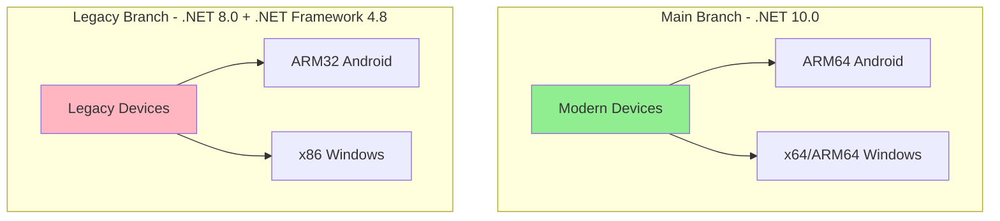
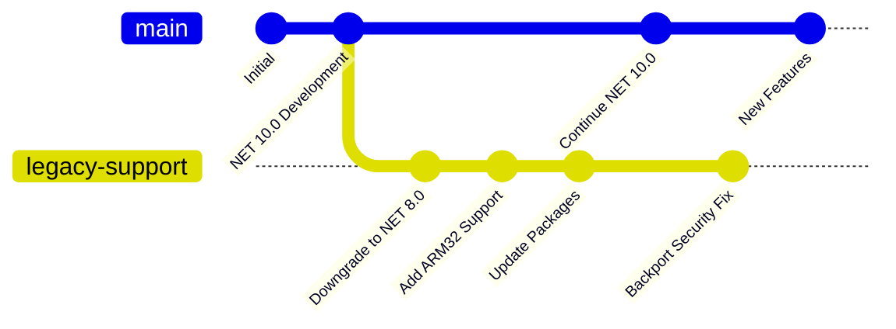
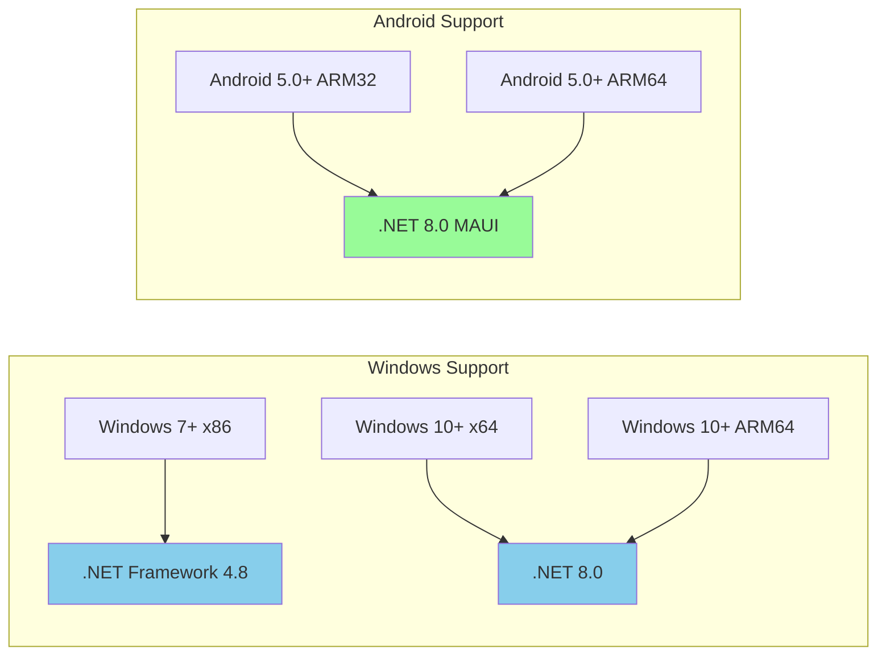
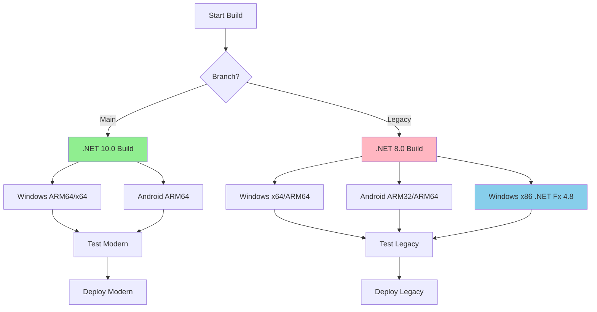
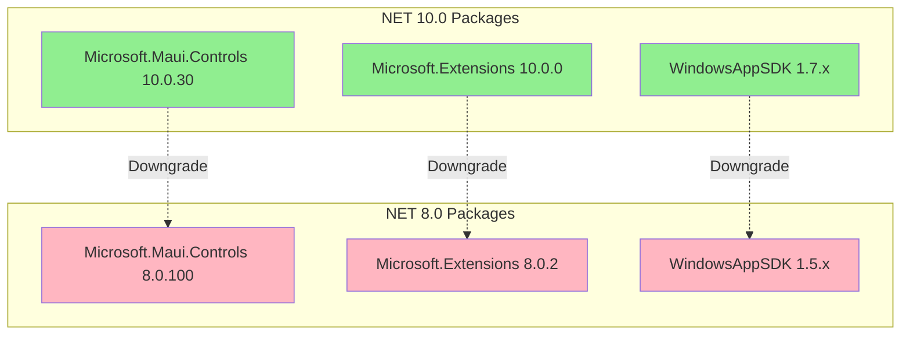
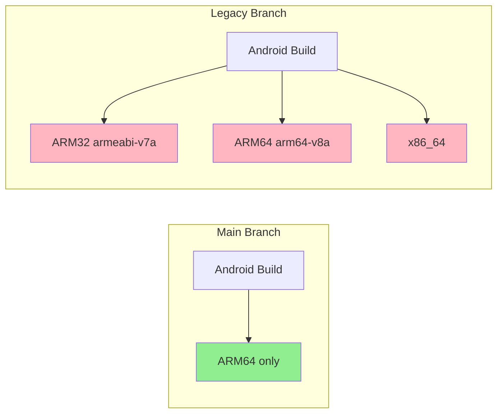
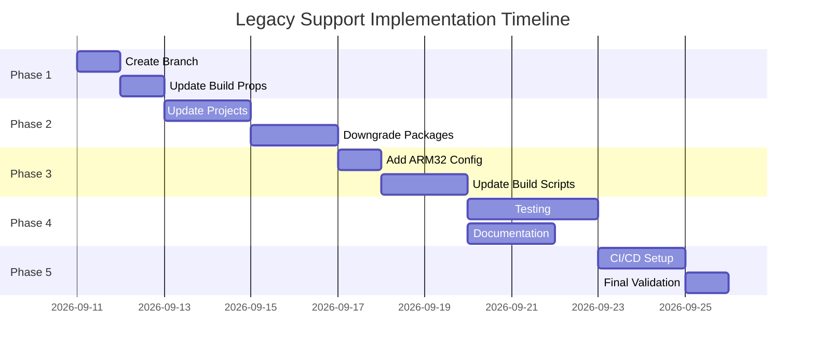
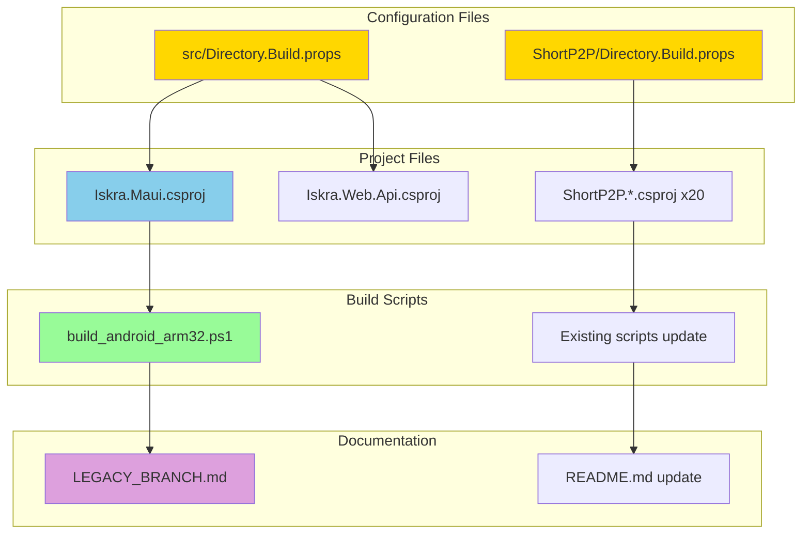
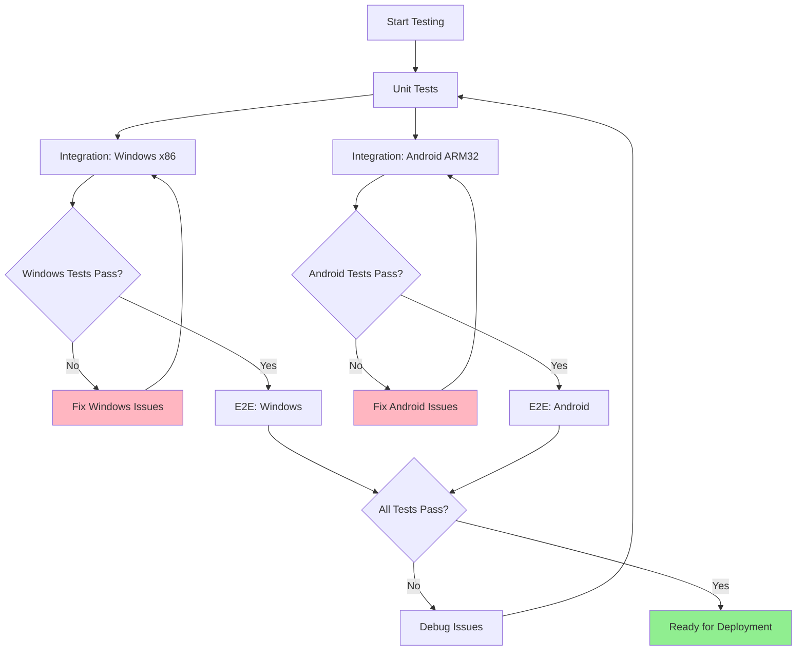
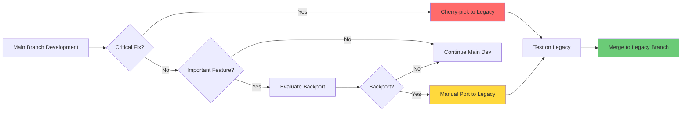

# Legacy Support Branch - Implementation Diagram

## Architecture Overview

## Branch Strategy

## Platform Support Matrix

## Build Pipeline Flow

## Package Dependency Changes

## Android ABI Support

## Implementation Phases

## File Changes Overview

## Testing Strategy Flow

## Maintenance Workflow

